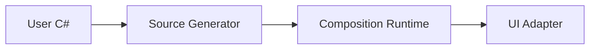

# DotNetCompose

**UI is a function of state.**

DotNetCompose is an experimental project that brings a Compose-inspired way of
building user interfaces to C# and .NET. Its main inspiration is **Jetpack
Compose**: describe the interface for the current state, compose it from small
functions, and let changes in that state drive UI updates.

You write C# methods marked with `[Composable]` and call them to describe a
screen. These methods can keep state, display controls, and describe child
content. When an event changes observable state, the runtime runs the affected
parts of the description again and applies the changes to the UI. This process
is called **recomposition**.

The project combines a composition runtime with a C# source generator that adds
the bookkeeping needed for this model. The same core is used by the terminal
UI (TUI) and .NET MAUI adapters, and can be connected to other UI trees.

NuGet packages are not available yet. The project is evolving rapidly, which
makes maintaining published packages difficult. For now, clone the repository
and use project references or run the included samples.

[Getting Started](docs/getting-started.md) · [Documentation](docs/README.md) ·
[Samples](#try-the-samples)

## A small example

This complete `Program.cs` runs a counter using the terminal UI adapter:

```csharp
using System;
using DotNetCompose.Runtime;
using DotNetCompose.Tui;

// Start the terminal UI host and its event loop.
// The source generator creates Builders.Content from Content below.
TuiApplication.Run(Counter.Builders.Content);

public static partial class Counter
{
    [Composable]
    public static void Content()
    {
        var count = Composables.RememberState(0);

        Tui.Column(gap: 1, content: () =>
        {
            Tui.Text($"Count: {count.Value}");
            CounterButton(() => count.Value++);
        });
    }

    [Composable]
    public static void CounterButton(Action onClick)
    {
        Tui.Button("Add", onClick);
    }
}
```

`Content` assembles the interface by calling other composable methods, including
the user-defined `CounterButton`. `RememberState(0)` keeps the counter's state
between executions. 

### From C# to UI updates

At compile time, the source generator creates a version of each composable
method with an extra **composition context** parameter. You do not declare or
pass this parameter in the code you write. The generator also rewrites the
composable calls inside each method to pass that context along: `Content`
passes it to `CounterButton`, which passes it to `Tui.Button`.

Conceptually, the generated methods inside `Counter.Builders` look like this.
`IComposerContext` is the context type, and `__ctx` is its generated parameter
name. This shortened view omits group operations, argument/default-state
parameters, diagnostic calls, and callback wrappers:

```csharp
// Not real generated code. 
// Pseudo code provided for concept demonstration purposes only
public static partial class Counter
{
  public partial class Builders
  {
      // User's Content function
      public static void Content(IComposerContext __ctx)
      {
          var count = Composables.Builders.RememberState(0, __ctx: __ctx);

          Tui.Builders.Column(gap: 1, content: (childContext, _, _) =>
          {
              Tui.Builders.Text($"Count: {count.Value}", __ctx: childContext);
              CounterButton(() => count.Value++, __ctx: childContext);
          }, __ctx: __ctx);
      }
        // User's CounterButton function
      public static void CounterButton(Action onClick, IComposerContext __ctx)
      {
         Tui.Builders.Button("Add", onClick, __ctx: __ctx);
      }
   }
}
```

The generated child-content callback receives a context too. The ordinary
`onClick` callback keeps its original signature: it changes state later, when
the button is pressed.

The context is the object through which the executing code works with the
composition runtime. It gives a call access to the remembered values at its
current position and lets it describe UI nodes and their updates. Passing it
through nested calls lets those calls participate in the same composition,
while keeping their own positions and remembered values.

`Counter.Builders.Content` is the generated entry point passed to the terminal
host. When the host runs a composition pass, the runtime supplies the context
to that entry point. The generated code marks execution boundaries and tracks
arguments where needed, so the runtime can relate this pass to previous ones.

The runtime retains remembered values and observes reads of snapshot state.
When state changes, it runs the affected content again and computes updates.
The UI adapter applies those updates to its node tree; for this example, the
TUI adapter displays the result in the terminal.



Read [Core concepts](docs/concepts.md) for the ideas behind this process, or the
[Source Generator guide](docs/source-generator.md) to explore how the code is
transformed.

See the [TUI guide](docs/tui.md#project-setup) to set up a console project with
the required references.

## Choose a direction

| Component | What it provides | Start here |
| --- | --- | --- |
| **Core concepts** | The ideas behind composition, state, recomposition, and UI updates. | [Concepts guide](docs/concepts.md) |
| **Runtime** | The composition engine, state, and effects; integration with your own node tree. | [Runtime guide](docs/runtime.md) |
| **Source Generator** | How to write composables and how the compiler integrates them with the runtime. | [Generator guide](docs/source-generator.md) |
| **TUI** | Building interactive terminal interfaces. | [TUI guide](docs/tui.md) |
| **MAUI** | Using composable content in a .NET MAUI application. | [MAUI guide](docs/maui.md) |

Start with [Getting Started](docs/getting-started.md) to run an application, or
read [Core concepts](docs/concepts.md) to explore the ideas behind composition,
state, and recomposition. The [documentation index](docs/README.md) lists all
guides.

## Try the samples

Each sample has its own requirements and launch instructions:

- [Terminal task editor](src/DotNetCompose.Tui.Sample/README.md): an interactive
  application with input fields, a task list, and action buttons.
- [MAUI application on Windows](src/DotNetCompose.Maui.Sample/README.md): native
  views, state-driven controls, themes, and navigation.

## Feedback and license

Report bugs and suggestions through [GitHub issues](https://github.com/ruLegen/DotNetCompose/issues),
including a small reproduction and your SDK/platform information.

See [LICENSE](LICENSE) for the project license and [NOTICE](NOTICE) for attribution
and licensing notices concerning work derived from Jetpack Compose.
