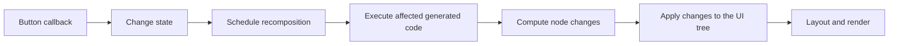

# Core concepts

DotNetCompose is inspired by the programming model of Jetpack Compose. Its central
idea is **UI is a function of state**, often written as `UI = f(state)`. Your C#
code describes what the interface should look like for the current state. When
that state changes, the framework evaluates the relevant description again and
updates the interface to reflect the new values.

**Composition**, **observable state**, and **positional memoization** make this
model practical. Composition lets you build the description from smaller parts.
Observable state tells the framework which parts need to react to a change.
Positional memoization retains values between executions, giving each occurrence
of a component its own memory.

This page starts with those mechanisms, then explains how the source generator
and runtime support them in C#.

## Composition: describing an interface

A composable method describes a part of the interface for its current inputs.
Calling other composables combines those parts into a larger description. A
screen can call a column, the column can contain text and a button, and a larger
screen can include that whole component.

For example, this terminal component describes a counter:

```csharp
using System;
using DotNetCompose.Runtime;
using DotNetCompose.Tui;

public static partial class Counter
{
    [Composable]
    public static void Content()
    {
        var count = Composables.RememberState(0);

        Tui.Column(gap: 1, content: () =>
        {
            Tui.Text($"Count: {count.Value}");
            CounterButton(() => count.Value++);
        });
    }

    [Composable]
    public static void CounterButton(Action onClick)
    {
        Tui.Button("Add", onClick);
    }
}
```

`Column` arranges children vertically. `CounterButton` is another composable
that adds the **Add** button; separating it into a method lets other screens
reuse that part of the description. These methods return `void`: their calls
record how to create or update **nodes**, objects in the target UI tree,
rather than returning controls to the caller.
We will follow that recording process [below](#why-a-void-method-can-describe-ui).

Executing this description establishes a **composition**: a retained record of
the content currently present, the values it remembers, and the state it reads.
That record lets a later execution relate its content to what was there before.
A **host** is the part of an application that owns composition and its event
loop. The [complete counter program](../README.md#a-small-example) starts the
terminal host through `TuiApplication.Run`.
A **composition pass** is one evaluation of content and the changes it produces;
the host applies those changes to the interface.

The `content` lambda describes children while composition runs. The button's
event callback runs later, in response to a click. Keeping these two roles in
mind helps explain why a screen description can run many times while an event
handler runs when the user performs an action.

## State and recomposition

In the counter, `count` refers to an observable state object. Its `Value` is the
number displayed by the label. The button callback increments that value; the
label's description reads it.

During composition, a state read records a dependency: this part of the
description used this state object. When its value changes, the runtime knows
which observed parts may need to run again. Running composition code again to
account for changed inputs or state is called **recomposition**.

On the first pass, the label reads `0` and describes `Count: 0`. A click changes
the state to `1`. On the next relevant pass, the same code reads `1` and describes
`Count: 1`. The framework applies the resulting changes to the UI. Existing
controls can be retained while their properties are updated.

An ordinary field or local variable does not provide this notification mechanism.
DotNetCompose uses **snapshot state**, observable values whose reads and writes
are tracked by its snapshot system. Here, that tracking connects the label's
read to the button's later write. Marking the dependent content as needing
another execution is called **invalidation**. Assigning
an equivalent value normally produces no change notification; the default policy
compares values with `EqualityComparer<T>.Default`. Mutating fields of an object
stored inside state does not by itself write a new state value.

State can also belong to an ordinary ViewModel or application object.
`Composables.CreateMutableState(initialValue)` creates it outside composition;
reading its `Value` during composition still establishes a dependency. Its owner
decides how long to keep it.

There is another question, though: if `Content()` runs again, why does
`RememberState(0)` not create a fresh counter initialized to `0`?

## Positional memoization: remembering by place

An ordinary local initializer runs whenever its method body runs. To keep a
value across executions, composition needs somewhere to retain it and a way to
recognize that place on the next pass.

**Positional memoization** means remembering a value at a particular position
in the composition. That position comes from the path and order of composable
calls and remembered operations. It is a position in the description's execution
structure, independent of the control's coordinates on screen.

For `RememberState(0)`, the first visit creates a state object and stores it at
the current remembered position. A later visit to the same position retrieves
that object. The `0` initializes new state; it does not reset retained state.
After a click, the retrieved object's value is still `1`.

Consider using the same counter twice:

```csharp
using DotNetCompose.Runtime;
using DotNetCompose.Tui;

public static partial class TwoCounters
{
    [Composable]
    public static void Content()
    {
        Tui.Column(content: () =>
        {
            Counter.Content();
            Counter.Content();
        });
    }
}
```

Both calls execute the same method and both use `RememberState(0)`, but each
occurrence has its own place in composition. Clicking the first counter changes
its state without changing the second counter's state.

| Occurrence | First pass | After clicking the first counter |
| --- | --- | --- |
| First `Counter.Content()` | Creates state with value `0` | Retrieves that state with value `1` |
| Second `Counter.Content()` | Creates another state with value `0` | Retains its own state with value `0` |

This also explains why the state does not belong to the method globally or to
the C# variable name `count`. It belongs to that occurrence in this composition.

`Composables.Remember(key, factory)` applies the same idea to arbitrary values.
It runs the factory for a new position and reuses its result on later visits.
Changing the key replaces the value at that position. The key is an additional
input to remembering, rather than a global dictionary key shared by all calls.

Remembering and observing state serve different purposes. `Remember` retains
an object; observable state reports changes to its value. `RememberState`
combines them by remembering an observable state object.

## How this works in C#

The runtime needs to know where execution is in composition, which remembered
position to visit, and how to re-enter an affected part later. The **composition
context** gives executing code access to that memory and to operations that
record the description. DotNetCompose's source generator adds a context
parameter and the code that carries this information through nested calls.

Generated code enters and leaves **groups**, regions of composable execution.
Inside them, ordered **slots** hold remembered values and comparison values.
The shared context follows these positions as calls execute. In `TwoCounters`,
each occurrence of `Counter.Content()` has its own region, so its call to
`RememberState(0)` visits a different retained slot. Sharing the context means
sharing the composition, while retaining memory at each call position.

You mark authoring methods with `[Composable]` and declare their containing
types `partial`. During compilation, the generator reads those methods and
adds composition-aware implementations in another part of the type. It also
rewrites composable calls inside the generated implementations. The original
authoring methods remain in the project as the input to this transformation.
This happens during the build; subsequent UI events execute the generated
methods without generating or compiling code again.

Here is a small example focused on a call between two methods:

```csharp
using DotNetCompose.Runtime;

public static partial class GenerationDemo
{
    [Composable]
    public static void Leaf(int value)
    {
    }

    [Composable]
    public static void Parent(int value)
    {
        Leaf(value);
    }
}
```

The generated `Leaf` has this signature (its body is omitted here):

```csharp
public static void Leaf(int value,
    DotNetCompose.Runtime.Composer.IComposerContext __ctx,
    DotNetCompose.Runtime.ComposableArgumentsState __changed = default,
    DotNetCompose.Runtime.ComposableArgumentsDefaultState __defaultParamState = default)
{
    // Generated body omitted.
}
```

The extra parameters connect ordinary-looking C# calls to composition:

- `__ctx` carries the active composition context, including access to groups
  and remembered positions.
- `__changed` carries what the caller knows about changes to the arguments.
  This helps eligible calls avoid repeating work when their inputs are unchanged.
- `__defaultParamState` records which computed-default arguments were omitted.

In the generated `Parent`, `Leaf(value)` becomes the following call. This
excerpt uses a Release compilation with runtime diagnostic instrumentation
disabled. Only the rewritten call is shown; the surrounding group operations
and the preparation of `__value_state` are omitted:

```csharp
// Excerpt inside the generated Parent; __value_state was prepared earlier.
global::GenerationDemo.Builders.Leaf(value,
    __ctx: __ctx,
    __changed: new DotNetCompose.Runtime.ComposableArgumentsState(stackalloc byte[] { __value_state }),
    __defaultParamState: default);
```

`__value_state` is the generated tracking value for the `value` argument. The
child receives the same context and the caller's information about that argument.
Other generated code compares inputs where appropriate and registers a
**restart delegate**, a callback that lets the runtime re-enter an affected
method without rerunning all its callers. The region whose dependencies and
restart callback are tracked is called a **restartable scope**.

An ordinary event callback remains event code: it can write state later without
becoming a composition description. Composable `content` callbacks are adapted
to receive the composition context when they execute.

The [generator guide](source-generator.md) explains the rules and modes. The
[complete transformation](advanced/generated-code.md) shows the surrounding
generated body, and [build settings](advanced/diagnostics-hot-reload.md) explain
which parts of the output are configurable.

## Builders: connecting the description to a host

For static composables, the generator puts the composition-aware methods in a
nested type named `Builders`. The counter's authoring method is
`Counter.Content`; its generated entry point is `Counter.Builders.Content`.

The host starts composition through that entry point:

```csharp
TuiApplication.Run(Counter.Builders.Content);
```

The host creates the composition and supplies the context when invoking the
delegate. From there, generated composable calls pass that context through the
description. Inside your authoring code you continue to write ordinary calls,
such as `Tui.Text(...)` or `Counter.Content()`.

Calling an authoring method directly from ordinary application code does not
establish this composition context. Use a host and the generated entry point
at that boundary. Instance composables get generated overloads on their original
type; the host selects the overload through its delegate signature. See
[static and instance entry points](source-generator.md#static-and-instance-entry-points).

## Why a void method can describe UI

The adapter turns component calls into operations on its node type. For the TUI
adapter, `TextNode` is a concrete object that stores the displayed text. A
**factory** creates that object when it is first needed; an **updater** assigns
the properties for the current state. `ComposeNode` records both operations
through the composition context.

Here is a simplified version of the adapter's [Text implementation](../src/DotNetCompose.Tui/Tui.cs).
Layout, style, and theme handling are omitted, but the node-recording call is
ordinary authoring C#:

```csharp
using DotNetCompose.Runtime;
using DotNetCompose.Tui;

public static partial class TextExample
{
    [Composable]
    public static void Text(string text)
    {
        Composables.ComposeNode(
            () => new TextNode(),        // Factory: create a node when needed.
            node => node.Text = text);   // Updater: apply the current text.
    }
}
```

On first application, a text node is created and inserted. When the same content
describes a new string, the runtime can keep the node and apply its updater with
that string. The call returns `void` because its result is recorded in the
composition, rather than returned as a C# value. A container uses the same
mechanism with a child-content callback to describe nodes beneath it.

The runtime does not know how to render `TextNode`. An **Applier**, supplied by
the adapter, implements insertion, removal, movement, and recorded updates for
that concrete tree. The [Runtime guide](runtime.md#nodes-and-the-applier-boundary)
explains this boundary in more detail.

## A small runtime model

The runtime retains the description using three useful building blocks:

| Term | Intuition |
| --- | --- |
| **Group** | A region of the execution whose identity and lifetime can be tracked across passes. |
| **Slot** | A retained place for a value, such as the counter state or an earlier argument used for comparison. |
| **Node** | An object in the target UI tree, such as a terminal text node or a native view. |

A composable can introduce a group without creating a control. A group can
contain remembered slots and child groups; node groups connect parts of that
record to UI objects. The slot table stores retained groups and values.

`Composition` owns this record between passes. During a pass, a `Composer`
matches the current description with the previous record and gathers changes.
An `Applier` applies node operations to the target tree. The TUI or MAUI adapter
supplies those nodes and handles their input, layout, and rendering.

When observed state changes, the host's `Recomposer` schedules work on its
**application context**, the dispatcher that runs host operations sequentially
on the owning thread. This execution context is different from the composition
context, which tracks memory and recorded operations. Generated restart
delegates let the runtime revisit affected scopes. **Skipping** means retaining
a scope's existing content without executing its body again when inputs and
observed state permit it. An affected child can still restart while its parent
body is skipped; the runtime follows the retained child structure.



Recomposition computes a new description and its changes. Applying changes
updates nodes; layout and rendering belong to the adapter. This separation lets
the same composition ideas work with different UI targets. The
[Runtime guide](runtime.md) covers the implementation and custom hosts in detail.

## Where to go next

- [Source Generator basics](source-generator.md#basic-reading-path): references, authoring rules, call transformation, and entry points.
- Then [Runtime](runtime.md): groups, slots, state, node updates, effects, and your own host.
- [Built-in composition functions](runtime.md#built-in-composition-functions): using remember, snapshot state, keys, and composition locals.
- [Advanced generator topics](source-generator.md#advanced-reading-path): modes, computed defaults, and debugging.
- [TUI](tui.md) and [MAUI](maui.md): building applications with the UI adapters.
- [Getting started](getting-started.md): requirements and runnable samples.

[Documentation index](README.md)
